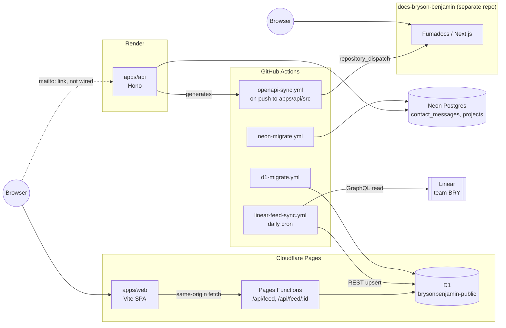

# System Architecture

A map of every deployment surface in the portfolio system, how they talk to each other, and why the boundaries sit where they do. This is the whole-system counterpart to [`docs/linear-sync.md`](./linear-sync.md), [`docs/migrations.md`](./migrations.md), and [`docs/docs-sync.md`](./docs-sync.md), which go deep on three of the cross-surface flows described here, and [`docs/stack.md`](./stack.md), which covers why each technology in this map was chosen.

## Principle

Three independently-deployable surfaces, each doing one job, connected by narrow, purpose-built pipes instead of a shared runtime or a shared database:

- **apps/web** (Cloudflare Pages) — the public site
- **apps/api** (Render) — the one thing that needs a real Postgres and a long-lived process
- **docs-bryson-benjamin** (separate repo, Cloudflare Pages) — the public docs site

Nothing here shares a database across surfaces, and nothing here shares a deploy trigger across surfaces. Where data needs to cross a boundary, it does so through a specific, one-directional pipeline (GitHub Actions cron, or `repository_dispatch`), not a shared connection string. That's a deliberate trade against a simpler "one API, one database" design — see [Architecture Decision: D1-Direct, No Postgres Detour](./linear-sync.md#architecture-decision-d1-direct-no-postgres-detour) for the reasoning behind the first of those pipes.

## Topology at a glance

## Deployment surfaces

### Cloudflare Pages — `apps/web`

The public site at `brysonbenjamin.com`. Deploys via Cloudflare's native Git integration — connected directly to this repo, building on every push to `main` and posting a preview URL on every PR. Build settings live in the Cloudflare Pages dashboard, not in this repo, and there is deliberately no GitHub Actions deploy step for it: `ci.yml` only typechecks and builds as a PR gate, it never ships anything.

`apps/web/functions/api/feed.ts` and `feed/[id].ts` are Cloudflare Pages Functions — edge Workers colocated with the static site, bound to D1 through the `PUBLIC_FEED_DB` binding in `wrangler.toml`. They serve the homepage feed widget straight from D1, read-only, with `Cache-Control` set for edge caching. This is the only backend the SPA talks to for anything feed-related; it never reaches Render for this.

### Cloudflare D1 — `brysonbenjamin-public`

One table, `public_feed_items`. The only writer is the Linear sync job (below); the Pages Functions above only ever read it. Two migration lineages coexist by design — see [`docs/migrations.md`](./migrations.md#cutover-from-ad-hoc-files) for the cutover story: `apps/web/d1/*.sql` is a frozen historical record, `apps/web/migrations/` is the live, wrangler-tracked one.

### Render — `apps/api`

A Hono service, deployed from `render.yaml`'s Blueprint with `autoDeploy: true`. Its `buildFilter` scopes rebuilds to `apps/api/**`, `packages/db/**`, and root config — a push that only touches `apps/web` or `docs/` doesn't trigger a Render deploy. Routes: `/`, `/health`, `/api/profile`, `POST /api/contact` (writes to Neon), and a self-generated `/openapi.json` via `@hono/zod-openapi`. CORS is locked to the `brysonbenjamin.com` origins.

`api.brysonbenjamin.com` is the recommended domain in the README, but that's dashboard/DNS state outside this repo — treat it as unconfirmed rather than assumed.

### Neon Postgres — via `packages/db`

Drizzle ORM schema (`contact_messages`, `projects`), consumed only by `apps/api`. Nothing else in the system talks to Neon directly. Migrations are generated locally with `drizzle-kit generate` and auto-applied by `neon-migrate.yml`.

### docs-bryson-benjamin (separate repo)

A Fumadocs/Next.js static site at `docs.brysonbenjamin.com`, its own Cloudflare Pages project. It does not share a repo, a database, or a deploy trigger with anything above — the only thing that crosses the boundary is the OpenAPI spec (below).

## Cross-surface data flows

These pipelines carry data across otherwise-isolated surfaces. All are GitHub Actions, all are one-directional, and all are documented as "fail loud, don't half-apply" — see each workflow for specifics.

### Linear → D1 (public feed sync)

`linear-feed-sync.yml`, daily cron + manual dispatch, runs `apps/api/src/jobs/syncLinearFeed.ts`. It queries Linear's GraphQL API for `public-feed`-labeled issues on team `BRY`, and upserts/prunes `public_feed_items` in D1 directly over Cloudflare's D1 REST API — not through `apps/api`'s own runtime, and not through wrangler. Full detail, including the public gate and grace-period rules, is in [`docs/linear-sync.md`](./linear-sync.md).

### apps/api → docs-bryson-benjamin (OpenAPI dispatch)

`openapi-sync.yml` triggers on push to `main` when `apps/api/src/**` changes. It generates `apps/api/openapi.json` from the live Hono/Zod route definitions, then fires a `repository_dispatch` (`event_type: openapi-sync`) at `docs-bryson-benjamin`, carrying the spec as the payload. That's how the docs site's generated API reference stays current without the two repos sharing code or a CI pipeline — per the [content architecture decided in BRY-19](https://linear.app/brysonbenjamin/issue/BRY-19), the generated reference is never committed to git in either repo; it's rebuilt at docs-site build time from whatever spec the last dispatch delivered.

### docs/ → docs-bryson-benjamin (guides sync)

`docs-sync.yml` triggers on push to `main` when `docs/**` changes. It converts every `docs/*.md` file to Fumadocs-shaped `.mdx` (frontmatter title/description, cross-doc links rewritten) and fires a `repository_dispatch` (`event_type: guides-sync`) at `docs-bryson-benjamin`, which writes the files under `content/docs/guides/` and commits straight to `main`. Full mechanics, including what the conversion does and its known gaps (no pruning of removed docs, Mermaid diagrams render unrendered), are in [`docs/docs-sync.md`](./docs-sync.md).

### Contact form (documented, not yet wired)

`POST /api/contact` is fully built — validated, OpenAPI-documented, writes to Neon — but nothing in `apps/web/src` calls it. The SPA's contact link is currently a plain `mailto:`. Worth tracking as a gap rather than assuming the form is live.

## CI and migrations

`ci.yml` is a pure gate: typecheck + build on push to `main` and on every PR, no deploy side effects. Both databases apply pending migrations automatically via path-triggered GitHub Actions workflows on push to `main` — see [`docs/migrations.md`](./migrations.md) for the full mechanics and the reasoning for using GitHub Actions over a Render pre-deploy command.

## Where this document lives

This file is the working copy, kept in `docs/` alongside the flow-specific docs it references. It's also the source of truth: `docs-sync.yml` forwards it (and every other `docs/*.md` file) to `docs-bryson-benjamin/content/docs/guides/` on every push to `main`, per [`docs/docs-sync.md`](./docs-sync.md). Editing the copy that lands in `docs-bryson-benjamin` directly would be overwritten on the next sync — this file is the one to edit.

This supersedes the earlier plan (from BRY-19) of guides being hand-authored directly in `docs-bryson-benjamin`: for this repo's own `docs/`, generation turned out to be worth it for the same reason it was for the OpenAPI spec — one source, no drift. BRY-19's model still holds for content that has no natural home in this repo (decisions/ADRs, narrative-only pages).
