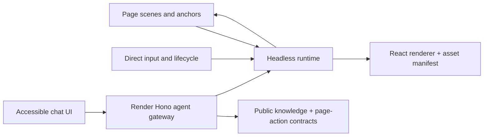
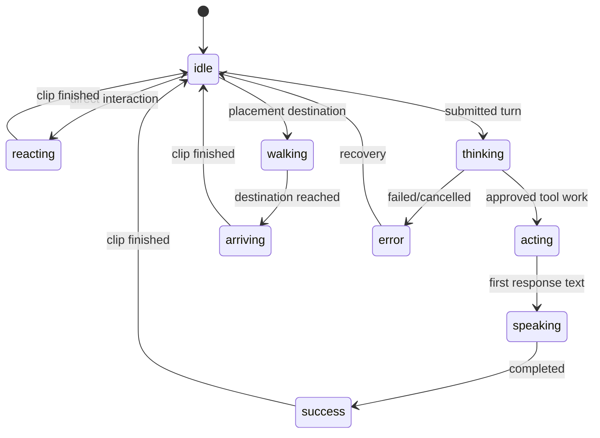
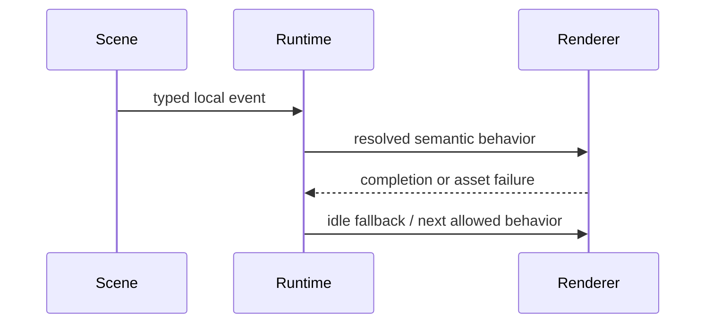
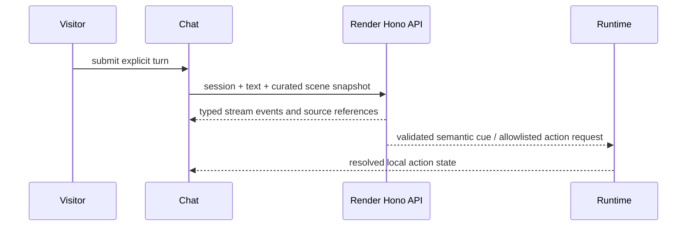

# ADR 001: Sa-Sa contracts and system boundaries

**Status:** Accepted for MVP  
**Date:** 2026-07-22

## Decision

Use a headless TypeScript runtime and shared contracts as the source of semantic behavior. React renders manifest-resolved assets; page scenes provide allowlisted context; a Render-hosted Hono API owns agent streaming, sessions, source lookup, and tool validation.

## Dependency rules

- `features/sa-sa/contracts` has no React, DOM, provider, Hono, or asset dependency.
- The runtime has no DOM query, route condition, CSS, model, or network dependency.
- The renderer consumes resolved semantic state and asset metadata; it emits completion/error events.
- Scenes register structured anchors, safe zones, public context, and actions. They never choose assets.
- The agent accepts curated context and emits validated text, source references, tool calls, and semantic cues. It never emits CSS, selectors, file names, arbitrary URLs, or executable code.

## Endpoint topology

Choose the existing Render Hono API for agent streaming at `api.brysonbenjamin.com`. In production, the Cloudflare Pages function at `/api/sa-sa/*` is a fixed same-origin relay to the configured `SA_SA_API_URL`; it forwards the visitor origin, preserves the SSE body, and cannot accept an arbitrary target. In local development, Vite proxies the same `/api/sa-sa/*` path to `VITE_API_URL`. A deployment smoke test must exercise the public same-origin stream endpoint so local success cannot mask a Pages 404 or a buffered relay.

## Session and degradation

Chat creates an opaque same-tab session only after deliberate open/submit. Session tokens belong in `sessionStorage`; server persistence stores only a hash if required. Renderer, runtime, chat, agent, and page action each fail independently to static/local behavior.

## Sequences

### Semantic behavior statechart

The statechart accepts only semantic events. The renderer maps each behavior to an asset plan; it does not decide transitions. The current pixel pack intentionally uses stable visual fallbacks for `walking` and `arriving` until locomotion assets land.

### Local behavior

### Agent turn

## Rejected alternatives

- A monolithic React mascot component: mixes behavior, assets, scenes, and chat.
- A client-held provider key or direct browser model call: violates server-secret and rate-control boundaries.
- Model-selected DOM/CSS/asset instructions: cannot be safely validated.
- Replacing the current architecture with a Rive/Canvas engine before the frame manifest proves insufficient.
